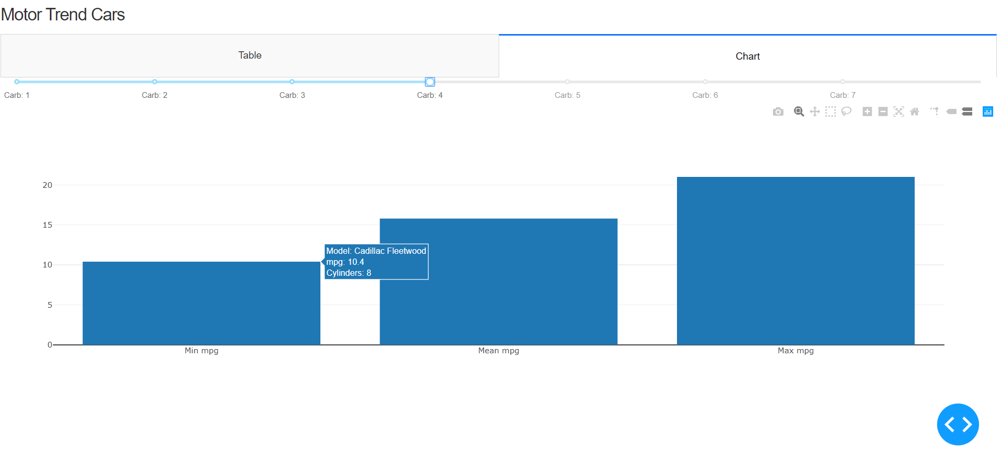

# Motor Trend Cars

### Introduction

This application filters and analyzes a dataset of fuel consumption / automobile design from a series of cars.
More information about the dataset can be found [here](https://stat.ethz.ch/R-manual/R-devel/library/datasets/html/mtcars.html).

### Requirements

* Python 3
* The required libraries are included in requirements.txt

### How to use the app

We suggest you clone this app and create a virtual environment to run this app locally: 

```
python3 -m venv myvenv
source myvenv/bin/activate
```

Install all dependencies: 

```
pip install -r requirements.txt
```
The command needed to run the app:
```
python app.py
```

Once installed, use the slider to filter the dataset based on number of carburators. The filtered table will be
displayed on the first tab, while the second tab will graphically represent the minimum, maximum and mean Miles/gallon 
(mpg) of the filtered results.



